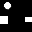
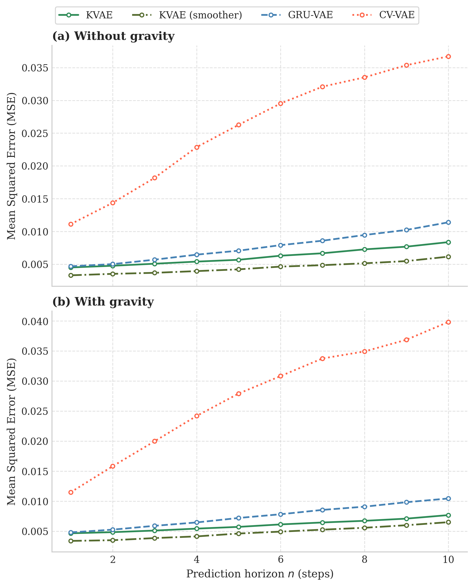

# KVAE — Kalman Variational Autoencoder with Obstacle-Conditioned Switching Dynamics

Hybrid model for latent state estimation combining a Variational Autoencoder
with a linear Gaussian state space model. The model learns to track a bouncing
ball from raw pixel observations, with obstacle-conditioned switching dynamics
that adapt the transition matrices based on the environment layout.

## Features

- **VAE encoder/decoder** — maps binary frames to a 2D latent space
- **Kalman filter** — provides temporally consistent state estimates with
  explicit uncertainty quantification
- **RTS smoother** — used during training for improved gradient flow through
  the mode selection network
- **Switching dynamics** — GRU-based network selects among K learned
  transition matrices conditioned on the current latent state and obstacle features
- **Bounce regularization** — encourages mode switches at detected collision events

## Demo

The animation below shows an example episode: the ball bounces off walls and obstacles 
while the model tracks its trajectory in latent space. 
When the ball turns red, it indicates masked timesteps with no observations.



## Results



## Project Structure
```text
├── config/       # VAEConfig, SimulationConfig, TrainConfig
├── dataset/      # BallDataset and physics simulator
├── models/       # KVAE, GRU-VAE, CV-VAE
├── training/     # Training loop and loss functions
├── evaluation/   # evaluate.py and metrics
├── utils/        # visualize.py
└── results.ipynb # Results notebook
```
## Training

```bash
python training/train.py --model kvae
python training/train.py --model gru_vae
python training/train.py --model cv_vae
```

## Evaluation

For a quick summary of all models with metrics and key plots:

```bash
jupyter nbconvert --to notebook --execute results.ipynb --output results_executed.ipynb
```

For detailed per-model evaluation with full visualizations:

```bash
# Kalman filter (online inference)
python evaluation/evaluate.py --model kvae \
    --checkpoint checkpoints/kvae/best_kvae.pt

# RTS smoother (offline inference)
python evaluation/evaluate.py --model kvae \
    --checkpoint checkpoints/kvae/best_kvae.pt \
    --smoother

# Baselines
python evaluation/evaluate.py --model gru_vae \
    --checkpoint checkpoints/gru_vae/best_gru_vae.pt
python evaluation/evaluate.py --model cv_vae \
    --checkpoint checkpoints/cv_vae/best_cv_vae.pt
```


